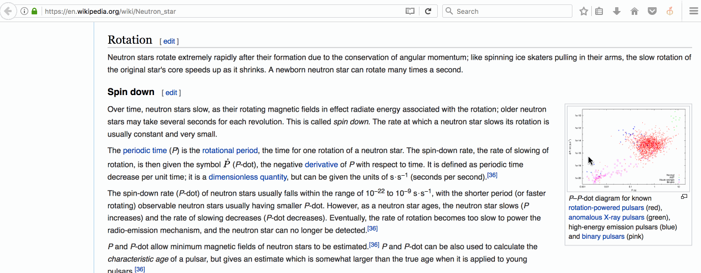

# Cyrillo _(Firefox Extension)_

 _Convert latin to cyrillic letters on any website_ 
 

## Setup
1. Download Web Extension for Mozilla Firefox [here](https://addons.mozilla.org/en-US/firefox/addon/cyrillo/).
2. When the extension will finish installing, you will be able to see the Cyrillo icon on your toolbar.
3. Go to any website and click on the icon. The latin letters on the website will be automatically converted to cyrillic letters.

## Licence
This repository is under the [Mozilla Public License](https://github.com/nagam11/Cyrillo/blob/master/LICENSE).
